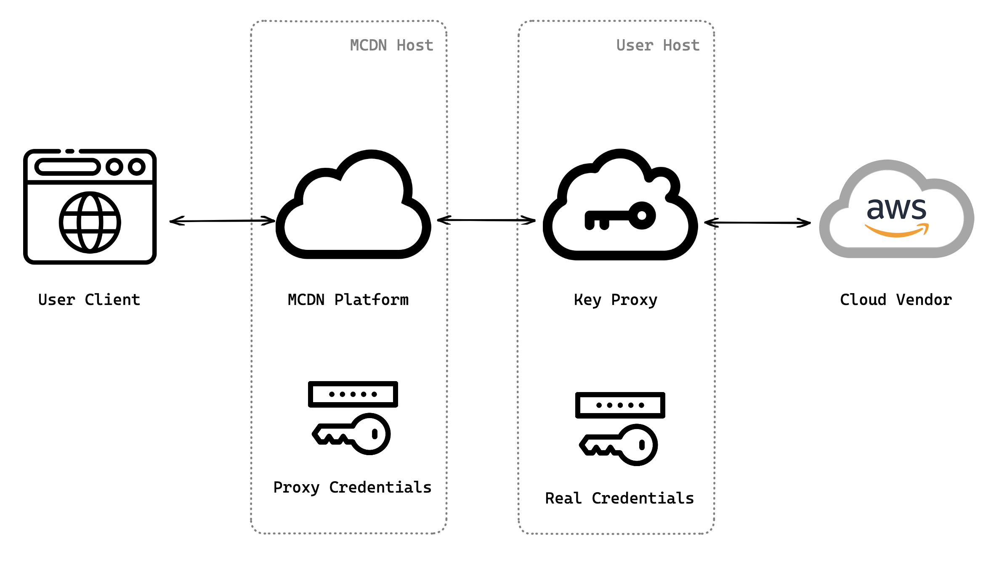
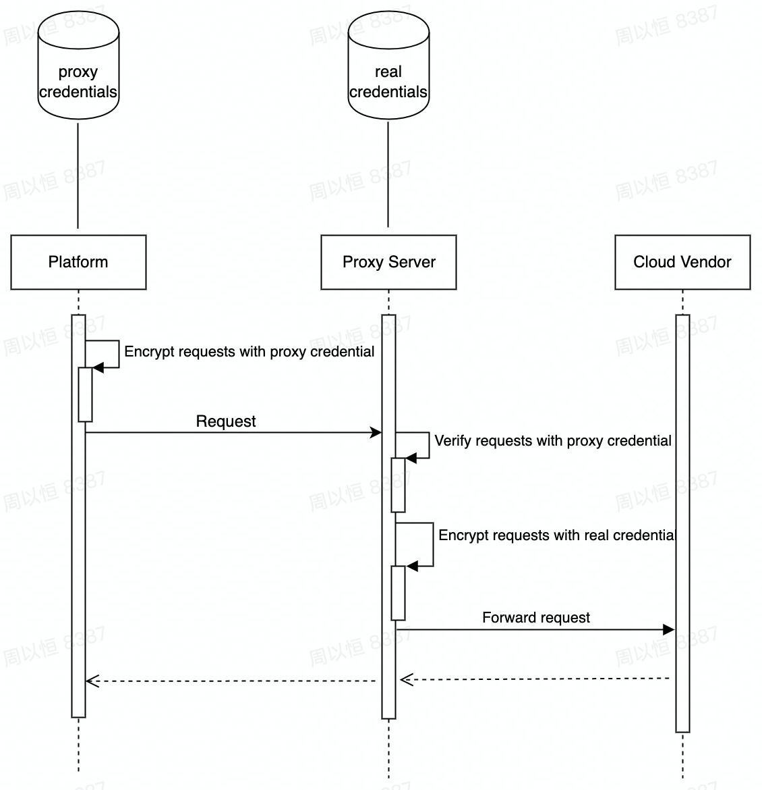

key-proxy
=========

## Overview

A solution for users who are concerned about the security of storing their cloud vendor credentials in the platform.
This project allows users to deploy a server in their own environment and store their real cloud vendor credentials on
it. Our platform will then send requests with proxy credentials (user-defined) to the user-deployed server, which will
verify the proxy credentials and forward the requests to the cloud vendor with the real credentials.

This mechanism ensures that users can securely and conveniently use the capabilities provided by the platform even if
they do not store their sensitive credentials in the platform.



## Working Principle

1. Setup the config (real and proxy credentials) of key proxy and deploy it. Set proxy server endpoint and create cloud
   accounts with proxy credentials in the platform.
2. While using proxy server, platform will send requests to proxy server with proxy (user-defined) credentials rather
   than real credentials.
3. After receiving requests in the proxy server, it will verify the correctness of them.
4. If requests are valid, proxy server will forward requests to cloud vendors with using real credentials that are only
   stored in the user side.
5. After obtaining responses from the cloud vendors, return them to the platform.



## Get Started

### Installation

```go
go get github.com/volcengine/key-proxy
```

### Run the proxy server

The basic example to run the proxy server on port 3888, for more details
visit: https://www.volcengine.com/docs/6766/176748, https://www.volcengine.com/docs/6766/176749.

```go
package main

import (
	"github.com/volcengine/key-proxy/common"
	"github.com/volcengine/key-proxy/pkg/proxy"
)

func main() {
	var err error
	keyProxy, err := proxy.New(&common.Config{
		Http: common.Http{
			Address: ":3888",
			Tls: common.Tls{
				Enabled: false,
			},
		},
		Endpoints: []common.Endpoint{
			{
				CloudAccountName: "volc_test",
				Vendor:           "volcengine",
				Credentials: common.Credentials{
					Proxy: common.Credential{
						AccessKey: "<proxy access key>",
						SecretKey: "<proxy secret key>",
					},
					Real: common.Credential{
						AccessKey: "<real access key>",
						SecretKey: "<real secret key>",
					},
				},
			},
		},
		Log: common.Log{
			Output:  "./output/log",
			Level:   "debug",
			MaxAge:  14,
			MaxSize: 100,
		},
		Forbidden: common.Forbidden{
			ForbiddenAccountNotFound:    false,
			ForbiddenProxyCredentialErr: false,
		},
	})
	if err != nil {
		panic(err)
	}
	err = keyProxy.Run()
	if err != nil {
		panic(err)
	}
}

```

## Security Considerations

Security is of utmost importance when deploying the Proxy Server. Here are some security considerations to keep in mind:

- Make sure to secure your host environment and the server itself.
- Keep the real cloud vendor credentials stored in the server secure.
- Regularly monitor the server for any security breaches or vulnerabilities.

## Code of Conduct

Please check [Code of Conduct](./CODE_OF_CONDUCT.md) for more details.

## Security Issue

If you discover a potential security issue in this project, or think you may
have discovered a security issue, we ask that you notify Bytedance Security via
our [security center](https://security.bytedance.com/src) or [vulnerability reporting email](sec@bytedance.com).

Please do **not** create a public GitHub issue.

## License

See the LICENSE file for details. Note: the license for this project is not 'open source' as described in the Open
Source Definition.